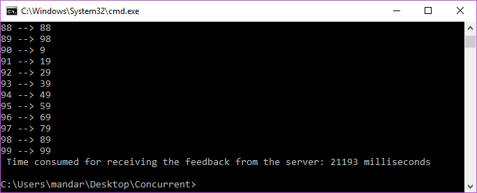
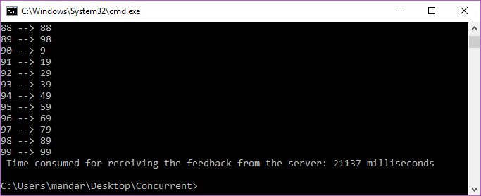

## Example
- Host a server at port 55555
  
  java Server 55555

- Make Simultaneous requests from 2 clients to the server

  java Client localhost 55555
  java Client localhost 55555

- OUTPUT

  // Here the requests from both servers are processed at the same time.

  - Client 1:

  

  
  - Client 2:
  
  

